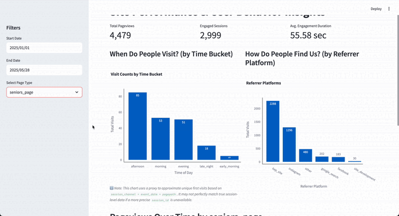

# Website Pageviews and User Engaement Tracker

## Purpose
This project helps to answer the question:
**Which landing pages drive the most traffic, engagement and client interest?**

By tracking where visitor sessions start, where they go, time on page and user growth, Kristen Elizabeth Photography can answer crucial questions about how the website is performing and what needs to be fixed.

The goal is to empower Kristen Elizabeth Photography, a high-end family and senior photography business, with the ability to make data-driven decisions about site design, SEO, and client acquisition. By identifying top-performing content and high-demand search gaps, the business can focus marketing efforts where they’ll have the most impact.

## Datasets and Technologies

### Datasets

| Source        | Description                           | Format | Phase     |
|---------------|---------------------------------------|--------|-----------|
| **Pageviews** | Live pageview/session data            | API    | AE |
| **Engagement**| Live user engagement and event data   | API    | AE |
| **User Data** | Live demographic and user-level data  | API    | AE |

### Technologies

| Tool          | Role                                                                 |
|---------------|----------------------------------------------------------------------|
| **Iceberg**   | Raw ingestion layer for scalable event and metadata storage         |
| **Snowflake** | Clean, modeled warehouse layer for metrics and dimensional modeling |
| **dbt**       | Build fact/dim models, qualtity testing, transformations               |
| **Airflow**   | Schedule and orchestrate ingestion, scraping, and enrichment tasks  |
| **Streamlit**   | Data visualization tool using python and hosted online  |

## Workflow
<ol>
<li> Live Google Analytics data ingestion daily into Iceberg </li>
<li> External table from Iceberg to Snowflake </li>
<li> dbt to build the intermediate table and fact tables </li>
<li> Airflow orchestrating the raw tables and fact tables in snowflake and dbt </li>
<li> Streamlit (python) to visualize the data from Snowflake </li>
</ol>

## Challenges Faced:
- Building a live GA data flow requires setting up authenticated API access and schema parsing
- Multiple fields named similarly in the API and pulling the correct ones
- Airflow and Snowflake connector not recognizing the account information in dag
- Accidentally deleting the virual evironment and having to reinstall from the requirements document
- Unable to get a user_id or session_id from the Google Analytics API so proxies had to be used for joining and analysis
- New to Airflow
- Tableau was the prefered visualization tool, but the free version doesn't let you connect to Snowflake. I switched Streamlit and saved $900 from buying the full version of Tableau

## Future Enhancements
- Integrate a latitude and logitude API for mapping analyses
- Integrate Google Keyword Planner API for real time keyword opportunity analysis
- Use Search Console data for impression and ranking validation
- Incorporate anomaly detection for spikes/drops in traffice or keywords automatically

## Data Quality Checks
Each data source has two quality checks in the ingestion phase:
- For the session date field, there is the possiblity of a "(not set)". If the the parsing fails, the session date is just set to the date field.
- The second quality check ensures that metric dat atypes are consistent and numircally valid rather than keeping them as strings.

Each data source als has two quality checks inside dbt:
- Each source has a several not_null checks for different fields
- The fact_blog_engagement has an accepted values field which makes sure that no new page types are added into the warehouse
- The fact_event_engagement has an accepted values field which make sure that no new values are added for the different egagement levels on the website based on event counts per session
- The fact_user_session has an accepted values field which ensures there isn't a new classificaiton on how often a user comes to the website

# Dashboard
The dashboard was created using Streamlit. This was my first time using the dashboard tool and I would say I like it. I have filters to look at different timeframes and at the different pages on the website.

The timeline graph is not displayed unless you filter to a specific page due to cluttering.

If you want to play around with the dashboard click the link!
<a href="https://aecapstone-kepdashboard.streamlit.app/" target="_blank">Check out the Dashboard!</a>

# End Results
My wife and I did a strong SEO campaign on the website by optimizing the keywords for her niches (senior and family photography) webpages. We also created 30+ blogs to help drive traffic to the website. The bad part about SEO is it takes 3-6 months for there to be a visible change to the number of visitors to the website.

For example, on the timeline graph for the senior_page, I have a red line when we started the SEO optimization on February 1st 2025, you can see that the traffic to the website has increase dramatically. We can also see this in the number of bookings she has recieved. For the first time in her business's 4 years, she has completely booked out for the months of June, July and August. 

I will say that it is because of the SEO optimization we did that we can clearly see on the timeline. She is currently on pace to double her revenue from 2024 and double the number of senior photography sessions booked year over year.

The end user of the dashboard is my wife and she has said that she has learned more from this dashboard than what Google Analytics provides because GA is not user friendly to people who are not as technical. 